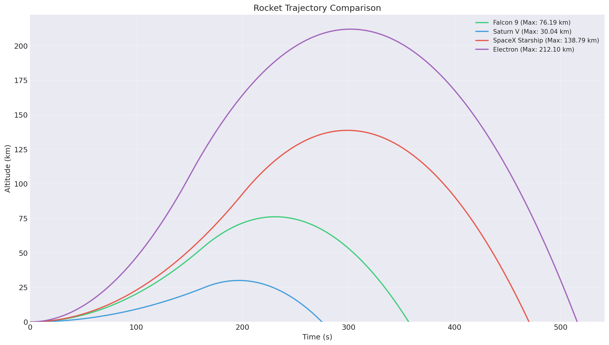

# Rocket Simulator

[](https://pypi.org/project/rocket-sim/)
[](https://pypi.org/project/rocket-sim/)
[](https://opensource.org/licenses/MIT)
[](https://github.com/rramboer/rocket-sim/actions/workflows/ci.yml)
[](https://github.com/astral-sh/ruff)

A small, educational physics-based rocket trajectory simulation library for Python. Simulate vertical rocket launches with altitude-dependent gravity, visualize trajectories, and compare real-world rockets.



## Features

- **Altitude-dependent gravity** using Newton's inverse-square law
- **13 pre-configured rockets** including Saturn V, Falcon 9, Starship, and more
- **Custom rockets** — create and simulate your own designs
- **Multiple celestial bodies** — Earth, Moon, and Mars, or roll your own
- **Plots** with multiple matplotlib styles (trajectory, velocity, dashboard, comparison)
- **CLI & library** — use as a command-line tool or import as a Python library
- **Type-safe** — full type hints throughout the public API
- **Well-tested** — pytest suite covering physics and simulation logic

### Modelling caveats

This is a deliberately simplified educational model:

- Motion is **1-D vertical only** (no pitch-over, no horizontal velocity, no orbital insertion).
- **Mass is constant** during flight; propellant burn is not modelled.
- **No atmospheric drag** is applied to trajectories. (`Physics.atmospheric_density` and `Physics.drag_force` are exposed as standalone utilities for users doing their own analyses.)

For a realistic 6-DOF aerospace simulation, see tools like RocketPy.

## Quick Start

### Installation

```bash
pip install rocket-sim
```

Or, for development:

```bash
git clone https://github.com/rramboer/rocket-sim.git
cd rocket-sim
pip install -e ".[dev]"
```

### Command Line Usage

```bash
# Simulate a preset rocket
rocket-sim --preset "Falcon 9" -o falcon9.png

# Simulate all presets
rocket-sim --all-presets -o comparison.png

# Custom rocket
rocket-sim --mass 50000 --thrust 1000000 --burn-time 120 --name "My Rocket"

# Interactive mode
rocket-sim --interactive

# List available presets
rocket-sim --list-presets
```

### Python Library Usage

```python
from rocket_sim import RocketSimulation, get_preset, Plotter

# Simulate a Falcon 9 launch
config = get_preset("Falcon 9")
sim = RocketSimulation(config)
result = sim.run()

# Print results
print(f"Max Altitude: {result.max_altitude_km:.2f} km")
print(f"Max Velocity: {result.max_velocity:.2f} m/s")
print(f"Flight Time: {result.flight_time:.2f} s")

# Create visualization
plotter = Plotter()
plotter.plot_trajectory(result, filename="falcon9.png")
```

### Compare Multiple Rockets

```python
from rocket_sim import simulate_multiple, get_preset, Plotter, list_presets

# Get all preset configurations
configs = [get_preset(name) for name in list_presets()]

# Run simulations
results = simulate_multiple(configs)

# Compare trajectories
plotter = Plotter()
plotter.plot_multiple_trajectories(results, filename="comparison.png")
```

### Create a Custom Rocket

```python
from rocket_sim import RocketConfig, RocketSimulation, Plotter

# Define custom rocket
config = RocketConfig(
    mass=100_000,       # 100 tons
    thrust=2_000_000,   # 2 MN thrust
    burn_time=180,      # 3 minute burn
    name="My Custom Rocket"
)

# Check thrust-to-weight ratio
print(f"T/W Ratio: {config.thrust_to_weight_ratio:.2f}")

# Simulate and plot
sim = RocketSimulation(config)
result = sim.run()

plotter = Plotter()
plotter.plot_dashboard(result, filename="dashboard.png")
```

## Available Rocket Presets

| Rocket          | Mass (kg) | Thrust (N) | Burn Time (s) | T/W Ratio |
| --------------- | --------- | ---------- | ------------- | --------- |
| Saturn V        | 2,900,000 | 33,800,000 | 165           | 1.19      |
| SpaceX Starship | 5,000,000 | 72,000,000 | 200           | 1.47      |
| Falcon 9        | 549,054   | 7,607,000  | 162           | 1.41      |
| Space Shuttle   | 2,030,000 | 30,600,000 | 510           | 1.54      |
| Delta IV Heavy  | 733,000   | 17,840,000 | 360           | 2.48      |
| Atlas V         | 584,000   | 10,500,000 | 270           | 1.83      |
| Ariane 5        | 777,000   | 11,600,000 | 540           | 1.52      |
| Soyuz-2         | 308,000   | 4,150,000  | 290           | 1.37      |
| Long March 5    | 867,000   | 10,600,000 | 480           | 1.25      |
| Vega            | 137,000   | 2,310,000  | 110           | 1.72      |
| Electron        | 12,550    | 240,000    | 150           | 1.95      |
| New Shepard †   | 75,000    | 490,000    | 110           | 0.67      |
| Vulcan Centaur  | 546,700   | 11,340,000 | 180           | 2.11      |

† New Shepard's listed first-stage thrust gives T/W < 1 at the masses shown, so the simulator reports immediate landing. The numbers reflect public BE-3 specs; treat the result as a sanity-check signal, not a flight prediction.

## Physics Model

The simulation uses realistic physics including:

- **Gravity**: Newton's law of universal gravitation with inverse-square falloff

  ```
  g(h) = GM / (R + h)²
  ```

- **Escape Velocity**: Minimum velocity to escape gravitational field

  ```
  v_esc = √(2GM / (R + h))
  ```

- **Atmospheric Density** (utility, *not* applied to trajectories): Exponential atmosphere model exposed via `Physics.atmospheric_density(...)`
  ```
  ρ(h) = ρ₀ × exp(-h / H)
  ```

Where:

- `G` = 6.674×10⁻¹¹ m³/kg/s² (gravitational constant)
- `M` = 5.972×10²⁴ kg (Earth's mass)
- `R` = 6.371×10⁶ m (Earth's radius)
- `ρ₀` = 1.225 kg/m³ (sea level air density)
- `H` = 8,500 m (scale height)

## Project Structure

```
rocket-sim/
├── src/rocket_sim/
│   ├── __init__.py      # Package exports
│   ├── physics.py       # Physics calculations
│   ├── models.py        # Rocket and Engine classes
│   ├── simulation.py    # Simulation engine
│   ├── visualization.py # Plotting tools
│   ├── presets.py       # Rocket configurations
│   ├── config.py        # Configuration management
│   └── cli.py           # Command-line interface
├── tests/               # Test suite
├── docs/                # Documentation
├── examples/            # Example scripts
├── pyproject.toml       # Project configuration
└── README.md
```

## Development

### Setup Development Environment

```bash
# Clone and install with dev dependencies
git clone https://github.com/rramboer/rocket-sim.git
cd rocket-sim
pip install -e ".[dev]"

# Install pre-commit hooks
pre-commit install
```

### Running Tests

```bash
# Run all tests
pytest

# Run with coverage
pytest --cov=rocket_sim --cov-report=html

# Run specific test file
pytest tests/test_physics.py
```

### Code Quality

```bash
# Lint and format (Ruff handles both)
ruff check --fix src tests
ruff format src tests

# Type checking
mypy src
```

## Contributing

Contributions are welcome! Please see [CONTRIBUTING.md](CONTRIBUTING.md) for guidelines.

1. Fork the repository
2. Create a feature branch (`git checkout -b feature/amazing-feature`)
3. Make your changes
4. Run tests (`pytest`)
5. Commit your changes (`git commit -m 'Add amazing feature'`)
6. Push to the branch (`git push origin feature/amazing-feature`)
7. Open a Pull Request

## License

This project is licensed under the MIT License - see the [LICENSE](LICENSE) file for details.

## Acknowledgments

- Rocket specifications sourced from public NASA and SpaceX data
- Physics equations based on classical orbital mechanics
- Inspired by NASA's trajectory simulation tools
